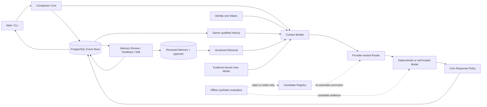

# HAVRE · 渡禾

HAVRE (Human-Aware Values, Reflection & Evolution) is an owner-controlled
research system for a long-term personal AI companion. It explores a practical
ML-systems question:

> How can a personal assistant preserve continuity, memory, values, privacy,
> and evidence across replaceable models without letting the model become the
> system of record?

The project is not a production-ready general assistant. Major development is
paused at this showcase checkpoint. No new training, Stage 9B, model promotion,
iPhone work, or broader sensing is authorized.

This repository is the sanitized, squashed public mirror of the private
research archive. Owner data, OA material, model weights, runtime state, local
paths, and the private Git history are not included. See
[PUBLICATION.md](PUBLICATION.md) for the exact publication boundary.

## What is implemented

- A provider-neutral Companion Core with typed contracts, durable PostgreSQL
  events, immutable inference lineage, and fail-closed response delivery.
- Human-reviewed episodic memory, pgvector retrieval, exact ContextPack
  provenance, corrections/retractions, and source-erasure closure.
- A versioned User Model with evidence-bound belief, state, and goal
  projections.
- A local Web chat with continuous history, response feedback, owner edits,
  episode consolidation, and provenance-preserving delivery.
- Self-hosted Qwen3-8B inference through a pinned llama.cpp runtime with
  process-bound attestation.
- Reproducible synthetic evaluation, QLoRA feasibility runs, candidate
  rejection gates, and owner-local deployment/rollback evidence.

Every item above has a direct source in
[docs/RESUME_EVIDENCE.md](docs/RESUME_EVIDENCE.md). Candidate, simulation, and
infrastructure evidence are deliberately not described as production
conversation quality.

## Architecture



The model proposes text. HAVRE Core owns authorization, memory provenance,
history eligibility, exact/structured serialization, durable delivery, and the
visible response hash. The database—not a prompt transcript—is the continuity
boundary. See [docs/ARCHITECTURE.md](docs/ARCHITECTURE.md),
[docs/EVENT_MODEL.md](docs/EVENT_MODEL.md), and
[ADR-0022](docs/adr/0022-core-governed-response-delivery.md).

## Five-minute synthetic demo

This is the public-safe synthetic demo; it never reads the normal owner
database.

Requirements: Windows PowerShell, the repository's `.venv`, PostgreSQL with
pgvector, and a dedicated loopback database whose name starts with
`havre_showcase_`. If you have the owner-local repository cluster, the shortest
path is:

```powershell
.\scripts\run_showcase_demo.ps1
```

From a fresh public clone, use an existing local PostgreSQL service:

```powershell
createdb -h 127.0.0.1 -p 55432 -U postgres havre_showcase_demo
.\scripts\run_showcase_demo.ps1 -ExternalDatabaseUrl 'postgresql://postgres@127.0.0.1:55432/havre_showcase_demo'
```

The Python boundary independently rejects remote hosts and database names that
do not start with `havre_showcase_`.

It creates only synthetic data and demonstrates:

```text
user interaction
  -> durable Event/history
  -> reviewed episodic memory
  -> gated retrieval and ContextPack
  -> deterministic model response
  -> feedback and owner edit
  -> episode membership and provenance audit
```

The machine-readable result is written to var/showcase/latest.json (ignored by
Git). If the repository-local PostgreSQL cluster was stopped, the runner starts
it and restores that stopped state afterward.

For a public-safe Web walkthrough:

```powershell
.\scripts\run_showcase_demo.ps1 -ServeWeb
```

Open the printed loopback URL and press Ctrl+C when finished. The URL contains
an ephemeral local bootstrap token, so do not include the address bar in a
screenshot or recording. Detailed capture and 1–2 minute video instructions
are in [docs/SHOWCASE_DEMO.md](docs/SHOWCASE_DEMO.md).

The synthetic runner uses the deterministic provider. It proves wiring,
durability, memory selection, feedback/edit lineage, and the provenance audit;
it does not prove model quality, production reliability, or capacity.

## Running the owner-local product

The normal daily-use profile is intentionally separate from the public demo
because it may contain private owner history:

```powershell
.\scripts\start_havre_desktop.ps1
# opens http://127.0.0.1:8765/chat
.\scripts\stop_havre_desktop.ps1
```

The page uses the real Companion Core and owner-local Event Store. It supports
continuous conversation/history, durability-gated streaming, response
feedback and edits, episode summaries, and concentrated memory review. Saved
feedback remains training_eligible=false; no training, promotion, or
deployment occurs.

General development setup requires CPython 3.12, PostgreSQL 18, and pgvector:

```powershell
python -m venv .venv
.\.venv\Scripts\python.exe -m pip install -r requirements.lock
$env:HAVRE_DATABASE_URL = 'postgresql://postgres@127.0.0.1:55432/havre'
.\.venv\Scripts\python.exe -m services.api.cli migrate
.\.venv\Scripts\python.exe -m services.api.cli serve --host 127.0.0.1 --port 8765
```

## Selected ML-systems experiments

- **Self-hosted inference:** Qwen3-8B GGUF Q4_K_M behind a pinned llama.cpp
  service, with executable/model/arguments/PID/loopback attestation and durable
  per-request lineage.
- **Retrieval safety:** a small checked-in synthetic benchmark compared legacy
  and gated retrieval. The gated version retained Recall@5/10 1.0 and MRR 0.90,
  while wrong-memory rate moved from 0.76 to 0.375 and duplicate group rate
  from 0.20 to 0.00. This is a fixture-level measurement, not a production
  semantic-quality claim.
- **QLoRA feasibility:** two Qwen3-8B seeds with 10,911,744 trainable parameters
  using NF4 + BF16 on a 12 GiB GPU. The formal training peak was 10,968 MiB
  PyTorch reserved memory. Both outputs remained unpromoted candidates.
- **Model-versus-system evaluation:** four-arm sealed evaluations and later
  adversarial reviews separated raw model behavior from Core containment.
  Candidates that fabricated memory or failed urgent-safety behavior were
  rejected rather than silently deployed.
- **Release reliability:** immutable Docker artifacts, two-phase activation,
  rollback, backup/restore, deletion replay, and exact-image verification were
  exercised for infrastructure only; no behavioral adapter was promoted.

Exact protocols, denominators, limitations, and links are in
[docs/RESUME_EVIDENCE.md](docs/RESUME_EVIDENCE.md).

## Verification

```powershell
$env:HAVRE_TEST_DATABASE_URL = 'postgresql://postgres@127.0.0.1:55432/<dedicated_test_database>'
.\.venv\Scripts\python.exe -m scripts.run_public_verification
.\.venv\Scripts\python.exe -m services.api.cli audit-provenance
.\.venv\Scripts\python.exe -m pip check
.\.venv\Scripts\python.exe -m compileall -q companion contracts identity mlsys scripts services tests
git diff --check
```

Database-backed claims require a dedicated disposable database and zero skipped
tests within the selected public matrix. Tests bound to deliberately excluded
private/local artifacts are enumerated—not reported as passing—in
[docs/PUBLIC_TESTING.md](docs/PUBLIC_TESTING.md). Historical checkpoints record
the exact environment, command, counts, and limits for their snapshot; current
checks do not retroactively upgrade those claims.

## Evidence and governance

- [docs/STATE.md](docs/STATE.md): implemented reality and current stop gate.
- [docs/ROADMAP.md](docs/ROADMAP.md): staged scope and approval boundaries.
- [docs/RESUME_EVIDENCE.md](docs/RESUME_EVIDENCE.md): claim-to-evidence map.
- [docs/PUBLIC_RELEASE_AUDIT.md](docs/PUBLIC_RELEASE_AUDIT.md): sanitized
  mirror publication/privacy review.
- [docs/PUBLIC_TESTING.md](docs/PUBLIC_TESTING.md): reproducible public test
  surface and explicit private-artifact exclusions.
- [docs/SHOWCASE_CHECKPOINT.md](docs/SHOWCASE_CHECKPOINT.md): exact current
  verification, limits, and handoff.
- [docs/](docs/): accepted, superseded, and rejected checkpoint records.
- [docs/adr/](docs/adr/): accepted architecture decisions.

Rejected checkpoints are retained because negative results are part of the
research evidence. They do not authorize later stages or imply production
quality.

## Public-release status

This mirror was created as a new squashed history with a public-safe author
identity and Apache-2.0 license. Its pre-push audit is in
[docs/PUBLIC_RELEASE_AUDIT.md](docs/PUBLIC_RELEASE_AUDIT.md). The private
archive remains the canonical governance and immutable-evidence source.
